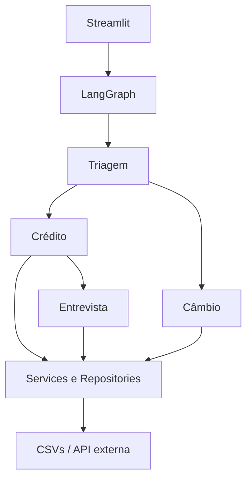

# Banco Ágil — Agente Bancário Inteligente

## Visão Geral

Aplicação demonstrativa de atendimento bancário conversacional. O cliente se autentica antes de consultar limite, solicitar aumento, refazer sua análise de crédito ou consultar câmbio.

## Arquitetura do Sistema



O LangGraph mantém o estado e executa handoffs internos. A interface apresenta somente o Banco Ágil.

## Agentes

- Triagem: coleta CPF e nascimento, autentica e identifica o assunto.
- Crédito: consulta limite e persiste/análise pedidos de aumento.
- Entrevista: coleta dados financeiros e atualiza o score.
- Câmbio: identifica a moeda e consulta sua cotação em BRL.

## Fluxo de Atendimento

CPF → data de nascimento → autenticação (até três tentativas) → assunto. As operações bancárias só ficam disponíveis após autenticação. “Encerrar”, “tchau” e expressões similares finalizam a sessão.

## Estrutura do Projeto

```text
app.py                 interface Streamlit
src/agents             regras conversacionais por domínio
src/graph              estado e orquestração LangGraph
src/services           regras de negócio e integração HTTP
src/repositories       leitura e escrita dos CSVs
src/models             modelos Pydantic
data                   dados demonstrativos
tests                  testes unitários e de integração
```

## Manipulação dos Dados

`clientes.csv` guarda somente clientes fictícios. `solicitacoes_aumento_limite.csv` recebe timestamp ISO 8601 e status `pendente`, `aprovado` ou `rejeitado`; esta implementação persiste o status final após a análise. `score_limite.csv` usa `score_min`, `score_max` e `limite_maximo` — interpretação documentada porque o desafio não define o schema. O termo padronizado é `rejeitado`.

## Funcionalidades Implementadas

- Autenticação por CPF e data de nascimento, com bloqueio na terceira falha.
- Consulta e pedido de aumento de limite com decisão baseada em score.
- Entrevista sequencial e score determinístico limitado entre 0 e 1000.
- Atualização controlada do score do cliente no CSV.
- Cotação USD, EUR, GBP, ARS e JPY em BRL com tratamento de falhas HTTP.
- Encerramento de conversa e UI de chat com reinício de sessão.

## Tecnologias Utilizadas

Python 3.11+, Streamlit, LangGraph, Pydantic, pandas, httpx, python-dotenv e pytest. Gemini é configurável por ambiente para futuras interpretações naturais; a versão atual privilegia roteamento simples e determinístico, sem exigir chave para rodar.

## Escolhas Técnicas e Justificativas

LangGraph concentra estado e handoffs. CSV mantém o desafio simples e auditável. Pydantic valida os dados estruturados. Repositories isolam persistência e services concentram regra de crédito e HTTP. Regras críticas não dependem do LLM.

## Desafios Enfrentados e Como Foram Resolvidos

A persistência CSV foi isolada para evitar alterações acidentais em outros clientes. Os fluxos de chat exigem contexto entre mensagens; LangGraph e `st.session_state` resolvem essa continuidade. A API de câmbio é isolada e coberta por mocks, sem testes dependentes de internet.

## Como Executar

```bash
python -m venv .venv
# Windows
.venv\Scripts\activate
# Linux/macOS
source .venv/bin/activate
pip install -r requirements.txt
copy .env.example .env  # Windows (Linux/macOS: cp .env.example .env)
streamlit run app.py
```

## Configuração das Variáveis de Ambiente

`GEMINI_API_KEY` e `LLM_MODEL` são opcionais na versão atual. `EXCHANGE_API_URL` permite trocar o endpoint de câmbio. Nunca versione o arquivo `.env`.

## Como Executar os Testes

```bash
pytest -v
ruff check .
```

## Dados para Teste

Todos os dados são fictícios. Use, por exemplo:

| CPF | Nascimento | Cliente |
| --- | --- | --- |
| 111.444.777-35 | 15/05/1990 | Ana Silva |
| 222.333.444-05 | 20/10/1985 | Bruno Costa |
| 123.456.789-09 | 30/01/1998 | Carla Souza |

## Fluxo de Desenvolvimento

Alterações saem de branches `feat/*`, `fix/*`, `docs/*`, `chore/*` ou `qa/*`, são integradas e
validadas em `test` e somente então seguem para `master`. Veja [CONTRIBUTING.md](CONTRIBUTING.md).
