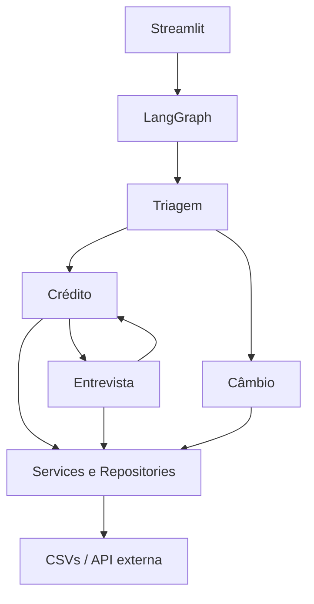

# Banco Ágil — Agente Bancário Inteligente

## Visão Geral

Aplicação demonstrativa de atendimento bancário conversacional. O cliente se autentica antes de consultar limite, solicitar aumento, refazer sua análise de crédito ou consultar câmbio.

## Arquitetura do Sistema

```text
Usuário
  → Streamlit
  → LangGraph
  → Agente responsável pelo contexto
  → Instruções e ações permitidas do agente
  → Gemini (decisão estruturada, quando configurado)
  → Validação da ação
  → Service / tool determinístico
  → CSV ou API
  → resposta
```



O LangGraph orquestra estado e handoffs internos. A interface apresenta somente o Banco Ágil.

Gemini interpreta a linguagem e escolhe uma capacidade **dentro do escopo do agente**. Python executa autenticação, score, aprovação, persistência e a API de câmbio.

Sem `GEMINI_API_KEY`, ou se o provedor falhar, o mesmo conjunto de ações é escolhido por um fallback determinístico. Frases como “um limite um pouco maior” são tratadas como pedido de aumento. Se só der para perceber que o assunto é limite, o fallback pergunta se o cliente quer consultar ou aumentar.

## Agentes

| Agente | Responsabilidade | Ações |
| --- | --- | --- |
| Triagem | Autentica o cliente e identifica a necessidade | `consult_limit`, `request_increase`, `start_interview`, `quote_exchange`, `clarify_limit`, `unsupported`, `end` |
| Crédito | Consulta limite, registra pedido e oferece entrevista | `consult_limit`, `request_increase`, `start_interview`, `quote_exchange`, `clarify_limit`, `unsupported`, `end` |
| Entrevista | Coleta dados financeiros e devolve o fluxo ao crédito | `continue_interview`, `consult_limit`, `request_increase`, `quote_exchange`, `unsupported`, `end` |
| Câmbio | Identifica a moeda e aciona a cotação permitida | `quote_exchange`, `consult_limit`, `request_increase`, `start_interview`, `unsupported`, `end` |

Cada agente tem role, escopo, instruções, ações permitidas e regras de handoff em `src/agents/profiles.py`. Uma ação fora da allowlist é rejeitada e o fallback determinístico assume.

## Fluxo de Atendimento

CPF → data de nascimento → autenticação (até três tentativas) → assunto. As operações bancárias só ficam disponíveis após autenticação. “Encerrar”, “tchau” e expressões similares finalizam a sessão.

Pedido de aumento:

```text
solicitação
  → CreditRequest com status pendente
  → persistência
  → consulta a score_limite.csv
  → status aprovado ou rejeitado
```

Se a análise falhar depois da criação, o registro permanece `pendente`.

Se o pedido for rejeitado e o cliente aceitar a entrevista, o score é atualizado em `clientes.csv` e o crédito reanalisa automaticamente o mesmo valor em uma **nova** solicitação, com novo timestamp, para preservar o histórico. Uma segunda rejeição não reabre a entrevista automaticamente.

## Estrutura do Projeto

```text
app.py                 interface Streamlit
src/agents             perfis, decisões e agentes de domínio
src/graph              estado e orquestração LangGraph
src/services           regras de negócio, Gemini compartilhado e HTTP
src/repositories       leitura e escrita dos CSVs
src/models             modelos Pydantic
data                   dados demonstrativos
tests                  testes unitários e de integração
```

## Manipulação dos Dados

`clientes.csv` guarda somente clientes fictícios. `solicitacoes_aumento_limite.csv` usa timestamp ISO 8601. `score_limite.csv` usa `score_min`, `score_max` e `limite_maximo` — interpretação documentada porque o desafio não define o schema. O termo padronizado é `rejeitado`.

## Funcionalidades Implementadas

- Autenticação por CPF e data de nascimento, com bloqueio na terceira falha.
- Consulta e pedido de aumento de limite com decisão baseada em score.
- Entrevista sequencial, score determinístico entre 0 e 1000 e reanálise automática do valor rejeitado.
- Atualização controlada do score do cliente no CSV.
- Cotação USD, EUR, GBP, ARS e JPY em BRL, com orientação para moedas conhecidas não suportadas.
- Encerramento de conversa e UI de chat com feedback visual e reinício de sessão.

## Tecnologias Utilizadas

Python 3.11+ (suíte executada em 3.11 e 3.14 neste repositório), Streamlit, LangGraph 1.2, Gemini via `langchain-google-genai` 2.x, Pydantic, httpx, python-dotenv, pytest e ruff.

## Configuração do modelo

| Parâmetro | Default | Motivo |
| --- | --- | --- |
| `LLM_MODEL` | `gemini-3.6-flash` | Modelo configurável sem hardcode de chave. |
| `LLM_TEMPERATURE` | `0` | Decisões de roteamento precisam ser previsíveis. |
| `LLM_TIMEOUT_SECONDS` | `10` | Evita esperar indefinidamente o provedor. |
| `LLM_MAX_RETRIES` | `1` | Uma retentativa curta; depois o fallback local assume. |

A saída é estruturada (`action`, `currency` opcional) e validada contra o perfil do agente.

## Escolhas Técnicas e Justificativas

LangGraph concentra estado e handoffs. Gemini não aprova crédito, não calcula score, não autentica e não grava CSV: essas regras precisam permanecer determinísticas, testáveis e auditáveis. CSV mantém o desafio simples. Pydantic valida dados estruturados. Repositories isolam persistência e services concentram crédito e integrações.

## Desafios Enfrentados e Como Foram Resolvidos

A persistência CSV foi isolada para evitar alterações acidentais em outros clientes. Os fluxos de chat exigem contexto entre mensagens; LangGraph e `st.session_state` resolvem essa continuidade. A API de câmbio é isolada e coberta por mocks, sem testes dependentes de internet. Intents “claros” também passam pelo agente quando o Gemini está configurado, para que a camada generativa não seja só um classificador opcional.

## Limitações e evolução para produção

Este projeto é demonstrativo. Em produção, CSV daria lugar a um banco transacional, a autenticação por CPF/nascimento a um serviço de identidade, secrets iriam para um secret manager e os logs para observabilidade estruturada. Nada disso foi implementado aqui de propósito.

## Como Executar

```bash
python -m venv .venv
# Windows
.venv\Scripts\activate
# Linux/macOS
source .venv/bin/activate
pip install -r requirements.txt
copy .env.example .env  # Windows (Linux/macOS: cp .env.example .env)
streamlit run app.py
```

## Configuração das Variáveis de Ambiente

`GEMINI_API_KEY` habilita decisões estruturadas por agente. Sem chave, a aplicação continua com fallback determinístico. `LLM_MODEL`, `LLM_TEMPERATURE`, `LLM_TIMEOUT_SECONDS` e `LLM_MAX_RETRIES` ajustam o cliente compartilhado. `EXCHANGE_API_URL` troca o endpoint de câmbio. Nunca versione o arquivo `.env`.

## Como Executar os Testes

```bash
pytest -v
ruff check .
```

Os testes usam Gemini mockado. Não há chamada real ao provedor na suíte automatizada.

## Dados para Teste

Todos os dados são fictícios. Use, por exemplo:

| CPF | Nascimento | Cliente |
| --- | --- | --- |
| 111.444.777-35 | 15/05/1990 | Ana Silva |
| 222.333.444-05 | 20/10/1985 | Bruno Costa |
| 123.456.789-09 | 30/01/1998 | Carla Souza |

## Fluxo de Desenvolvimento

Alterações saem de branches `feat/*`, `fix/*`, `docs/*`, `chore/*` ou `qa/*`, são integradas e
validadas em `test` e somente então seguem para `master`. Veja [CONTRIBUTING.md](CONTRIBUTING.md).
